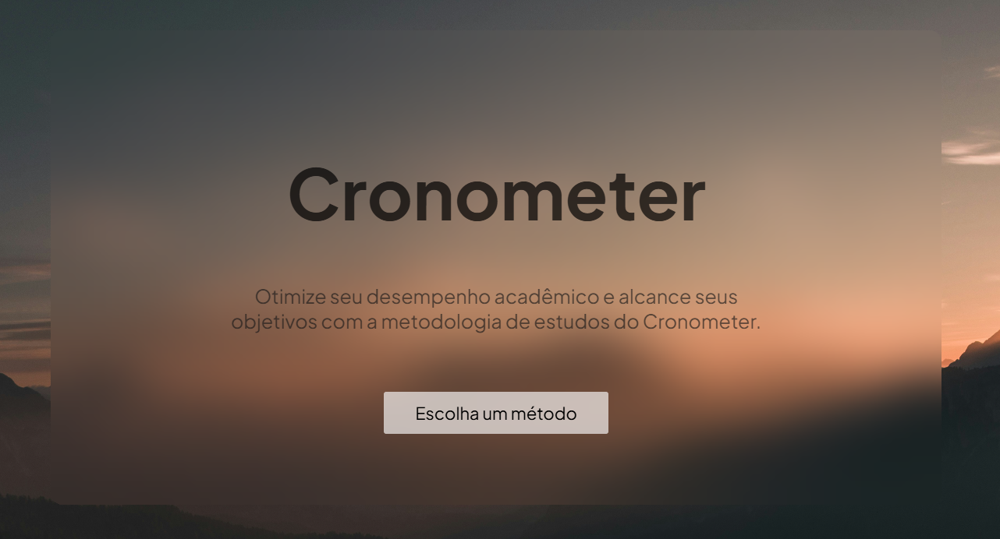

  

# 🕒 Cronometer

O **Cronometer** é uma aplicação web interativa desenvolvida com **HTML, CSS e JavaScript**, criada para ajudar a **gerenciar melhor o tempo**.  
O projeto reúne quatro funcionalidades principais: **Relógio, Cronômetro, Timer e Pomodoro**, tudo em uma interface limpa e intuitiva.

## 🚀 Funcionalidades

- ⏰ **Relógio:** exibe a hora atual em tempo real.  
- ⏱️ **Cronômetro:** permite iniciar, pausar e zerar o tempo.  
- ⏳ **Timer:** define um tempo personalizado e conta regressivamente.  
- 🍅 **Pomodoro:** aplica a técnica Pomodoro para melhorar foco e produtividade.  

## 💡 Tecnologias utilizadas

- **HTML5 Semântico** – estrutura do projeto  
- **CSS3** – design responsivo e estilização com `backdrop-filter`  
- **JavaScript** – lógica e interatividade  

## 🧠 Conceitos aplicados

- Controle de intervalos e timeouts em JavaScript  
- Uso de elementos semânticos (`<header>`, `<section>`, `<time>`, `<footer>`)  
- Organização modular de CSS e JS  

## 📱 Responsividade

O layout foi projetado para se adaptar bem em **diferentes tamanhos de tela**, mantendo boa usabilidade em desktops e dispositivos móveis.

## 🎯 Objetivo do projeto

Este projeto foi desenvolvido com o propósito de **praticar e demonstrar habilidades em front-end web tradicional**, aprimorando conhecimentos em **HTML, CSS e JavaScript puro**.

## 🔗 Acesse o projeto

👉 [Visualizar Cronometer](https://erikrafael03.github.io/Cronometer/)  

